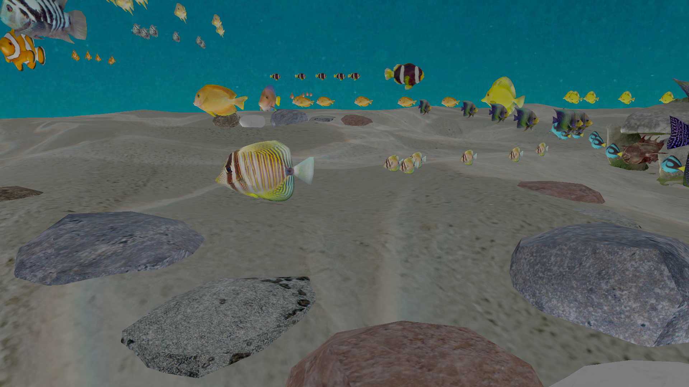
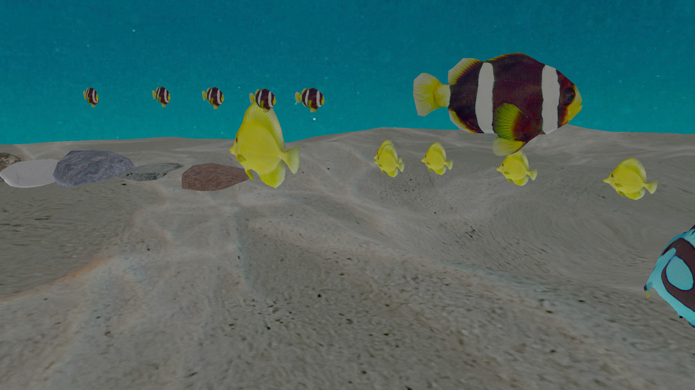
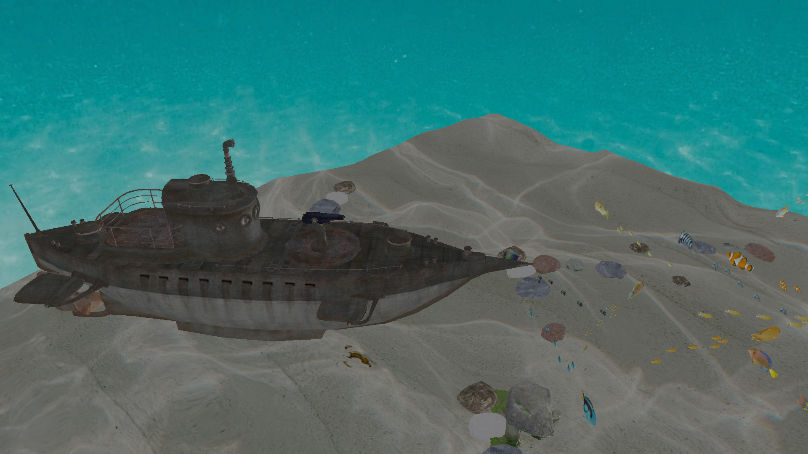
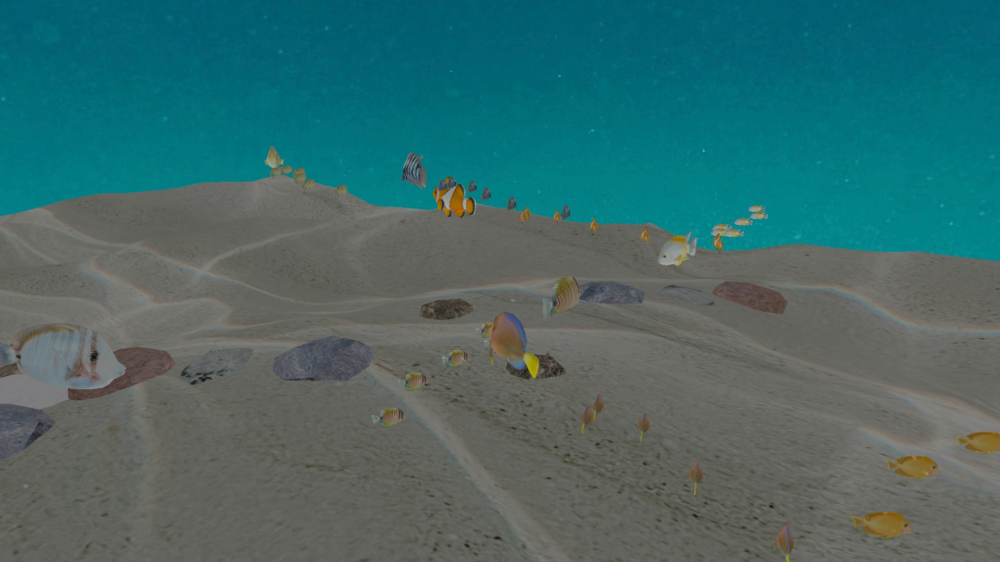
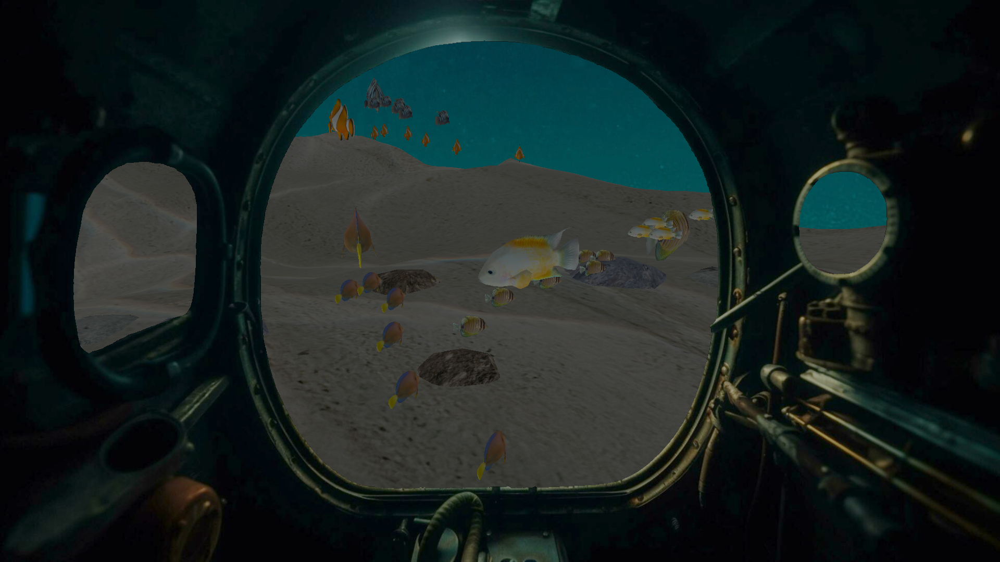

# Under_the_sea

Projekat iz predmeta Računarska Grafika na Matematičkom fakultetu, Univerziteta u Beogradu.

---------------------
# Komande

`F1` - on/off imgui

`B`  - centered cursor

`M`  - on/off mask

`W`  - move camera forward

`A`  - move camera left

`S`  - move camera back

`D`  - move camera right

`SPACE` - move camera up

`LSHIFT` - move camera down

 

---------------------

# Implementirano iz oblasti A:
* Cubemaps

# Implementirano iz oblasti B:
* HDR
* Bloom

 

# Uputstvo
1. `https://github.com/MSZ2/Under_the_sea.git`
2. Main se nalazi u src/main.cpp
3. Cpp fajlovi idu u src folder
4. Zaglavlja (h i hpp) fajlovi idu u include
5. Šejderi idu u folder shaders. `Vertex shader` ima ekstenziju `.vs`, `fragment shader` ima ekstenziju `.fs`

#  modeli
- [Turbosquid](https://www.turbosquid.com/3d-models/piper-pa-18-supercub-fbx-free/1041070)
- [FreeModels 123](123free3dmodels.com)
- [Texture Scan](https://www.texturecan.com)
- [Archive 3d](archive3d.net)
---------------

[Skelet projekta](https://github.com/matf-racunarska-grafika/project_base.git)

--------------------

# Galerija

